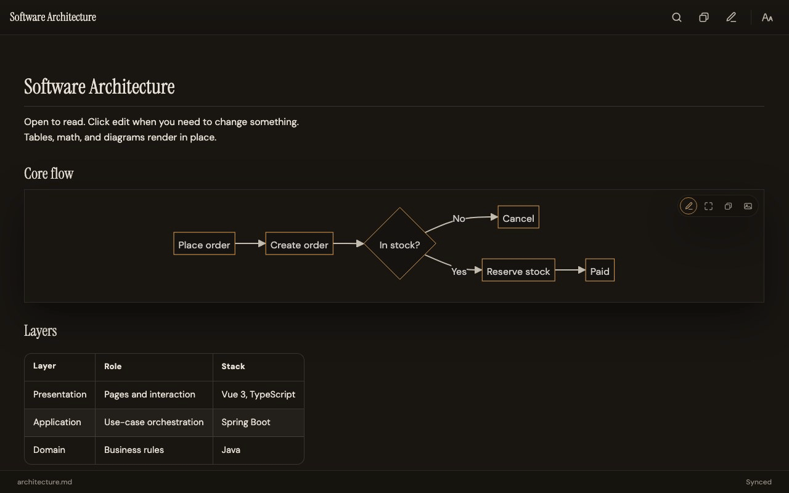

<p align="center">
  
</p>

<h1 align="center">墨览 · molan</h1>

<p align="center">
  <strong>打开即阅读，要点再编辑。</strong><br />
  <em>Open to read. Click to edit.</em>
</p>

<p align="center">
  Open-source Markdown on paper — browser studio, Cursor / VS Code extension,<br />
  and a shared editor core for the DesignWeave workbench.
</p>

<p align="center">
  <a href="https://fengshihao.github.io/molan/"></a>
  <a href="https://fengshihao.github.io/molan/try/"></a>
  <a href="https://github.com/fengshihao/molan/issues/new/choose"></a>
  <a href="https://open-vsx.org/extension/fengshihao/molan-markdown"></a>
  <a href="LICENSE"></a>
</p>

<p align="center">
  <a href="https://fengshihao.github.io/molan/">官网（多语言）</a> ·
  <a href="https://fengshihao.github.io/molan/try/">在线试读</a> ·
  <a href="https://molan.guoyoutech.cn/">正式站</a> ·
  <a href="https://marketplace.visualstudio.com/items?itemName=fengshihao.molan-markdown">VS Marketplace</a> ·
  <a href="https://github.com/fengshihao/molan/issues/new/choose">反馈 / Issues</a>
</p>

<p align="center">
  
</p>

---

## Why molan

| | |
| --- | --- |
| **先读后改** | 默认预览；要点处再进入编辑，不必一打开就面对源码墙 |
| **纸面气质** | 宣纸 / 墨夜 / 终端等多种纸面，为长时间阅读设计 |
| **同一套核心** | 浏览器工作室与 Cursor / VS Code 扩展共用编辑体验 |
| **面向 AI 贡献** | 官网可复制一句提示，让 AI 自己准备环境并开 PR |

扩展 ID：`fengshihao.molan-markdown`

---

## Quick start

```bash
git clone https://github.com/fengshihao/molan.git
cd molan
pnpm install
pnpm build
./molan              # local homepage
./molan try          # studio
./molan install      # marketplace extension
./molan help
```

| Command | Purpose |
| --- | --- |
| `./molan` | Open local site |
| `./molan try` | Open studio |
| `./molan docs` | Contribute guide |
| `./molan check` | Acceptance checks (required before PR) |
| `./molan e2e` | Studio browser e2e (auto Chromium) |

---

## Repository

```text
packages/molan-protocol   @molan/protocol
packages/molan-core       @molan/core
packages/molan-host       @molan/host
apps/studio               Browser studio
apps/vscode-molan         VS Code / Cursor extension
site/                     Website (GitHub Pages)
```

---

## Contribute with AI

1. Open https://fengshihao.github.io/molan/docs/ and copy the setup prompt into Cursor (or another coding agent).
2. Tell the agent what to change — one thing per PR.
3. Require `./molan check` (and `./molan e2e` when editing studio / editor UI).

Machine contract: [`AGENTS.md`](AGENTS.md) · [`docs/ai/START.md`](docs/ai/START.md)

---

## Release (maintainers)

```bash
./molan package          # build .vsix
./molan publish          # Open VSX (needs OVSX_PAT)
```

GitHub Actions: tag `v*` or run **Publish extension**. Configure `OVSX_PAT` in repo secrets (never commit tokens). VS Marketplace can still upload artifacts manually.

---

## DesignWeave

Clone this repo beside DesignWeave and depend via `file:../molan`. See [`docs/ai/ARCHITECTURE.md`](docs/ai/ARCHITECTURE.md).

---

## License

[MIT](LICENSE) · © molan contributors
