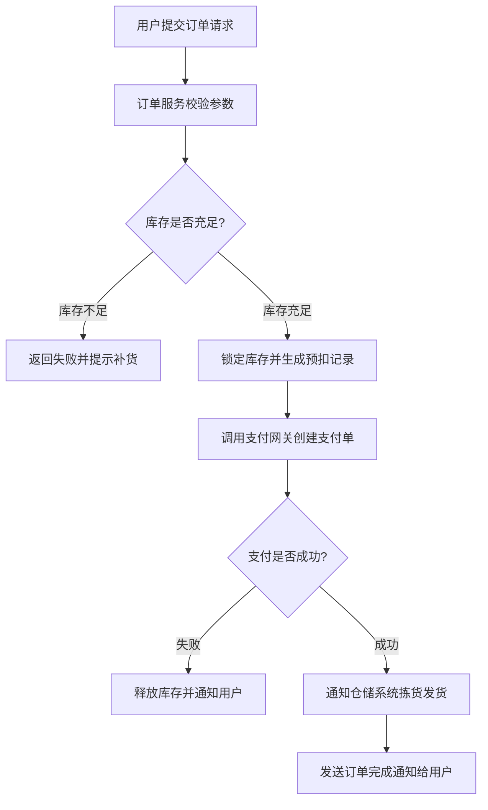
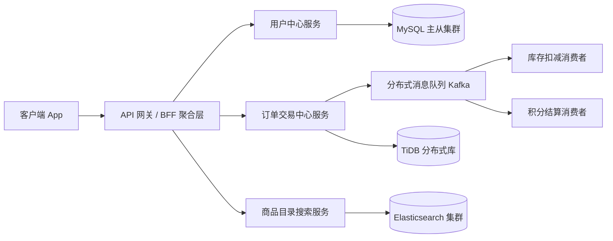

# 流程图测试

## 宽图 TD

```mermaid
flowchart TD
  A[用户提交订单请求] --> B[订单服务校验参数]
  B --> C{库存是否充足?}
  C -->|库存不足| D[返回失败并提示补货]
  C -->|库存充足| E[锁定库存并生成预扣记录]
  E --> F[调用支付网关创建支付单]
  F --> G{支付是否成功?}
  G -->|失败| H[释放库存并通知用户]
  G -->|成功| I[通知仓储系统拣货发货]
  I --> J[发送订单完成通知给用户]
```

## 宽图 LR

```mermaid
flowchart LR
  A[客户端 App] --> B[API 网关 / BFF 聚合层] --> C[用户中心服务]
  B --> D[订单交易中心服务]
  B --> E[商品目录搜索服务]
  D --> F[分布式消息队列 Kafka]
  F --> G[库存扣减消费者]
  F --> H[积分结算消费者]
  C --> I[(MySQL 主从集群)]
  D --> J[(TiDB 分布式库)]
  E --> K[(Elasticsearch 集群)]
```
