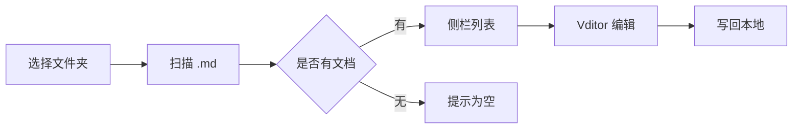

# 墨览示例文档

> 用本文件验证所见即所得编辑、代码、流程图、公式与表格。

## 行内与强调

这是一段带 **加粗**、*斜体*、`行内代码` 和 [链接](https://example.com) 的文字。

任务列表：

- [x] 选择本地文件夹
- [x] 列出 Markdown
- [ ] 在 Vditor 中编辑并保存

## 表格

| 元素 | 引擎 | 说明 |
| --- | --- | --- |
| 代码高亮 | Vditor | 常见语言着色 |
| 流程图 | Mermaid | mermaid 代码块 |
| 数学公式 | KaTeX | 行内与块级公式 |
| 表格 | GFM | 管道表格 |

## 代码

```typescript
type Doc = { path: string; text: string };

function open(doc: Doc): string {
  return doc.text.slice(0, 80);
}

console.log(open({ path: "readme.md", text: "# Hello" }));
```

## 流程图



## 数学公式

行内公式：质能方程 $E = mc^2$，以及欧拉公式 $e^{i\pi} + 1 = 0$。

块级公式：

$$
\int_{-\infty}^{\infty} e^{-x^2} dx = \sqrt{\pi}
$$

## 引用

> 本地 Markdown 目录是真相源；编辑器只是打开它的窗口。

## 保存验收

改完本节标题或勾选任务后，按 `Cmd/Ctrl+S`（或点「保存」），再用外部编辑器确认文件已更新。
